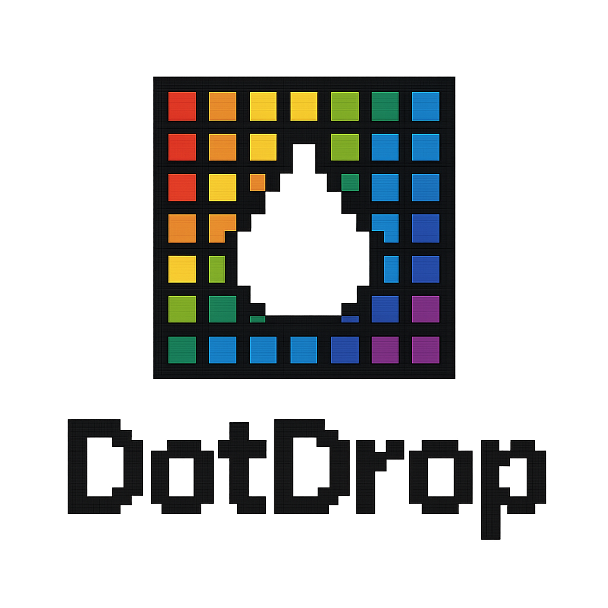

<p align="center">
    
</p>

# DotDrop - Collaborative Pixel Art Canvas

A real-time collaborative pixel-art canvas inspired by r/place. Join thousands of players in creating massive pixel art together!

Built with React, Canvas API, WebSockets, and Supabase.

🚀 **Live at:** https://dotdrop-art.netlify.app/

[](https://opensource.org/licenses/MIT)
[](https://reactjs.org/)
[](https://supabase.com/)

## ✨ Features

- 🖌️ **Interactive Canvas** — Place pixels on a 1218x630 collaborative canvas
- 🎨 **Grayscale Palette** — 15 colors from pure black to white
- ⏱️ **15-Second Cooldown** — Server-side rate limiting prevents spam
- 🌍 **Real-time Updates** — See other players' pixels instantly via WebSockets
- 💾 **Persistent Canvas** — All artwork saved in Supabase database
- 🔍 **Zoom & Pan** — Navigate the canvas with mouse wheel and drag
- 📍 **Pixel Tooltip** — Hover to see coordinates and color codes
- 🎮 **Draggable UI** — Move controls and palette anywhere on screen
- 📱 **Fully Responsive** — Optimized for desktop, tablet, and mobile
- 🔒 **Secure Backend** — Rate limiting, input validation, and RLS policies
- 🌐 **Fullscreen Mode** — Immersive canvas experience
- 🖥️ **Retro Design** — CRT terminal aesthetic with pixel-perfect styling

## 🎮 How to Play

1. **Choose a color** from the grayscale palette
2. **Click on the canvas** to place your pixel
3. **Wait 15 seconds** for cooldown to complete
4. **Collaborate with others** to create art together!
5. **Zoom and pan** to explore the entire canvas
6. **Drag controls** to position UI elements where you want them

## 🛠️ Tech Stack

- **Frontend:** React + Vite
- **Canvas:** HTML5 Canvas API with zoom/pan transforms
- **Real-time:** WebSocket (ws) for live presence and updates
- **Database:** Supabase with Row Level Security
- **Backend:** Node.js Express server with rate limiting
- **Styling:** Retro CSS with Press Start 2P font
- **Deployment:** 
  - Frontend: Netlify
  - Backend: Render
  - Database: Supabase

## 📦 Installation

- Local:
```bash
    npm run start
```

- Build:
```bash
    npm run build
```


